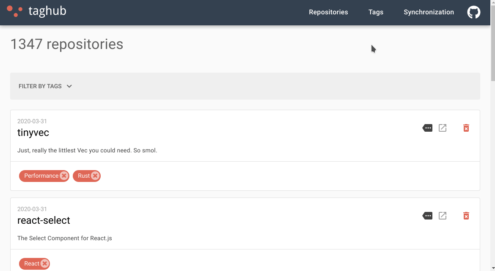

[](https://taghub.gustavohenrique.com)
-----

[](https://golang.org)
[](https://quasar.dev)
[]()

[](https://travis-ci.com/gustavohenrique/taghub)
[](https://coveralls.io/github/gustavohenrique/taghub?branch=master)
[](https://opensource.org/licenses/Apache-2.0)
[](https://www.paypal.com/cgi-bin/webscr?cmd=_donations&business=CLK3RJCCUNSR2&currency_code=USD&source=url)

[](https://taghub.gustavohenrique.com)

# TagHub

TagHub gets all repositories that I starred in GitHub since 2009 and allows me to add tags for them.

## Table of content

- [Getting Started](#getting-started)
- [Usage](#usage)
- [Architecture](#architecture)
- [Contrib](#contrib)
- [License](#license)

## Getting Started

First, ensure that you have Go >= 1.14, NodeJS >= 10.16 and make utility.
Then, create a [GitHub Personal Token](https://github.com/settings/tokens/new) and
add the token in `.makerc` file like this:

```sh
cd backend
echo "GITHUB_PERSONAL_TOKEN=69xyo22bc52rt3v8fx721b9d6b68092abacb123b" > .makerc
```

## Usage

Running the back-end:

```sh
cd backend
make run
```

Open another terminal instance, install the Quasar Framework and run the front-end:

```sh
cd frontend
npm i -g @quasar/cli
npm run serve
```

Now, you can open the front-end:

```sh
open http://localhost:15234  # or xdg-open in Linux systems
```

Also, you can generate a static version and deploy it to GitHub Pages, Netlify, AWS S3 etc.

```sh
cd backend
make json
cd ../site
npm run build
cd dist/spa
open index.html
```

## Architecture

There are 3 applications inside this mono repository:

- **backend**: Rest API written in Go.
- **frontend**: Admin interface using VueJS + Quasar Framework to manage tags and repositories.
- **site**: Static site that fetchs JSON files instead to Rest API.

### Backend

#### Directories

```sh
.
├── build                # automation scripts
├── cmd                  # exports repos and tags from database to JSON files
├── libs                 # private libs
│   ├── configuration    # config based on environment variables
│   ├── errors           # add custom code used by HTTP response
│   ├── filter           # mount an SQL Where statement based in some rules sent in POST request
│   ├── httpclient       # FastHTTP implementation used by the GitHub client
│   ├── github           # get starred repos from GitHub using v4 API as Rest client instead of GraphQL
│   ├── logger           # Logrus implementation
│   ├── stringutils      # some code to deal with strings
│   └── testutils        # help to write tests
├── pkg                  # store the application version according of the branch name
├── sql                  # database schema and initial data used in tests
└── src                  # the application source code
    ├── containers       # containers used for dependency injection
    ├── domain           # structs and interfaces
    ├── handlers         # routes and endpoints using Echo Framework
    ├── http             # HTTP server
    ├── sqlite           # run SQL queries
    └── services         # business logic and data transformation
```

#### Layers

- **handlers**: Rest API, the application's entrypoint, receive, validate and convert requests to structs. It looks like a orchestrator, forwarding the data to the service layer.
- **services**: Apply business roles and prepare the data before to send to the repository layer.
- **repositories**: Consume the SQLite database.

### Frontend

```sh
.
└── src
    ├── assets           # files compiled by Webpack
    ├── boot             # register components and libs like Axios
    ├── components       # Vue components
    ├── css              # custom CSS rules
    ├── layouts          # the top-level components
    ├── pages            # components rendered by routes
    ├── router           # mapping routes to pages
    ├── services         # get and send data to back-end
    └── statics          # images, favicon etc.
```

### Site

```sh
.
└── src
    ├── assets
    ├── boot
    ├── components
    ├── css
    ├── layouts
    ├── pages
    ├── router
    ├── services
    └── statics
        └── jsonfiles    # several JSON files generated by make json command
```

## Contrib

1. Open an issue asking for your new feature or bug fix.
2. Fork this repo and send a Pull Request.
3. Please don't be lazy as I and write some tests for you code.

## License

Apache-2.0
